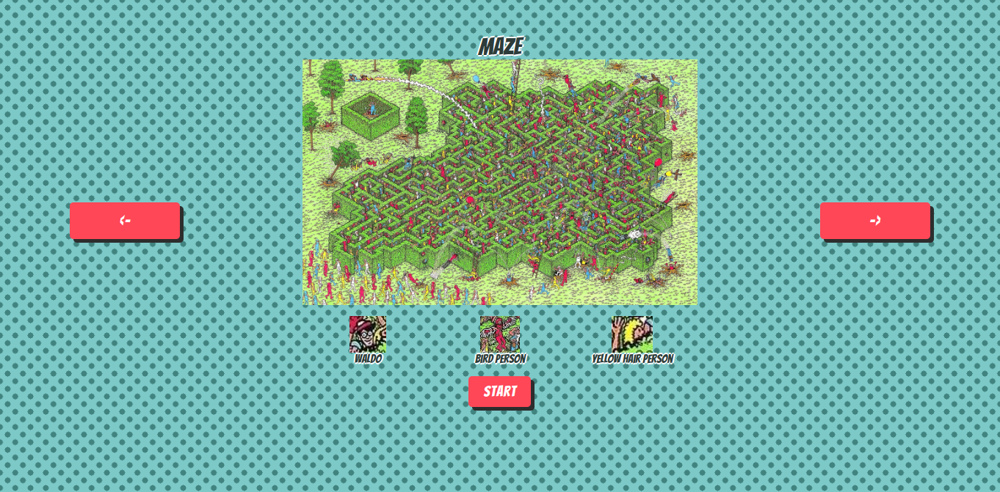

# Waldo
This is my Where's Waldo game created as part of The Odin Project (https://www.theodinproject.com/lessons/nodejs-where-s-waldo-a-photo-tagging-app). It consists of a selection screen with 3 maps to choose from, each map having three characters to find. It times you and gives you a final score at the end.

## Technologies
The project is a [Create React App](https://create-react-app.dev/) with plain css, and a mix of js and ts. The project also used to use firebase as the database for a highscore screen at the end and for storing the coordinates of where the characters were. However, firebase felt god-awful to work with and it just added unnecessary complexity to have character coords stored in a db. Moreover, this project was initially done when I didn't know ts, and I refuse to go back to using raw js, so the project is old code consisting of js and the parts I've come back to are ts.

You can see the code with firebase under the with-firebase branch

## Live demo on Github pages
https://joel-singh.github.io/waldo/

